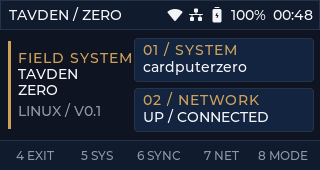

  

# Tavden Zero

Tavden Zero is an early Linux-native field-system proof of concept for the
M5Stack CardputerZero. It is a new application built around the Zero's Linux
environment rather than a direct port of the ESP32 Tavden Field Suite.

The proof of concept establishes a Tavden-branded, keyboard-first shell at the
device's native 320 × 170 resolution and adds safe local system and network
visibility. It follows Tavden's principles of purpose, clarity, durability and
careful claims while using the current official CardputerZero CMake/LVGL
application baseline.

> **Hardware status:** the desktop simulator, automated module test, AArch64
> executable and arm64 Debian package have been validated. No physical
> CardputerZero was available, so display, keyboard, launcher, battery and
> thermal behaviour remain explicitly unverified. See
> [the hardware test plan](docs/HARDWARE_TEST_PLAN.md).

## Current proof

| Area | Status |
| --- | --- |
| Native UI | Three Tavden views rendered at exactly 320 × 170 |
| Desktop build | Linux x86-64 release build succeeds |
| Automated test | Local system/network snapshot test passes |
| CardputerZero build | AArch64 GNU/Linux release executable succeeds |
| Install package | arm64 Debian package produced and inspected |
| Device permissions | No network access, background service or hardware permissions requested |
| Physical hardware | **Not tested — developer/evaluation hardware required** |
| App store | Metadata prepared; not submitted |

## Modules

### Overview

A compact Tavden shell with live host and link summaries, top-bar device state
and direct keyboard navigation.

### System

Read-only local reporting for:

- hostname and CPU architecture;
- uptime and one-minute system load;
- available/used memory;
- root filesystem usage; and
- capture time for the displayed snapshot.

### Network

Read-only local reporting for the preferred active non-loopback interface:

- interface name and inferred link type;
- local IPv4 address and link state; and
- kernel RX/TX byte counters.

The network module does not open network sockets, send packets, scan hosts,
change configuration or require elevated privileges. It reads standard Linux
interfaces such as getifaddrs, sysinfo, statvfs, /proc and /sys.

## Controls

| Key | Overview | Module view |
| --- | --- | --- |
| 4 / Escape | Exit | Return home |
| 5 | System | System |
| 6 | Refresh local state | Refresh local state |
| 7 | Network | Network |
| 8 | Toggle light/dark mode | Toggle light/dark mode |
| Help | Open keyboard guide | Open keyboard guide |
| Print Screen | Save the active 320 × 170 view | Save the active 320 × 170 view |

The bottom bar mirrors keys 4–8. On Linux, input is read from a configured
evdev device or from an automatically selected /dev/input/event* device.

## Architecture

The application preserves the useful separation in M5Stack's official
template while making Linux services first-class:

    Linux snapshot sources
              |
              v
      system_info::Snapshot
              |
              v
       BaseViewModel subjects
              |
              v
      LVGL screens and widgets
              |
              v
    fbdev + evdev on CardputerZero
      SDL2 simulator on desktop

Repository layout:

    src/
      app/         lifecycle, assets and screen management
      model/       page and theme state
      platform/    framebuffer, evdev, device state and screenshots
      reactive/    LVGL subject and theme bindings
      system/      read-only Linux system/network snapshot service
      view/        Tavden screens, widgets, palette and navigation
      viewmodel/   actions and observable presentation state
    tests/         host-side system snapshot smoke test
    docs/          architecture, provenance, outreach and device test plan
    screenshot/    native-resolution store and project screenshots

More detail is in [Architecture](docs/ARCHITECTURE.md) and
[Upstream baseline](docs/UPSTREAM_BASELINE.md). Completed pre-hardware checks
are recorded in [Validation](docs/VALIDATION.md).

## Build

### Requirements

- CMake 3.31 or newer;
- Ninja;
- a C++17 compiler;
- for desktop simulation: SDL2, FreeType, libpng, libjpeg, zlib and fmt;
- for CardputerZero: the aarch64-linux-gnu GCC/G++ cross compiler.

The CardputerZero preset fetches the official CM0 BSP sysroot release v0.0.4,
LVGL v9.5.0 and fmt when required.

### Linux desktop simulator

On Debian/Ubuntu, install the development dependencies:

    sudo apt update
    sudo apt install build-essential cmake ninja-build libsdl2-dev
    sudo apt install libfreetype-dev libpng-dev libjpeg-dev zlib1g-dev libfmt-dev

Configure, build and test:

    cmake --preset linux-x86-64
    cmake --build --preset linux-x86-64-rel
    ctest --test-dir build/linux-x86-64 -C Release --output-on-failure

Run:

    ./build/linux-x86-64/Release/tavden-cardputerzero

### CardputerZero AArch64 package

Install aarch64-linux-gnu-gcc and aarch64-linux-gnu-g++ using the package names
for the build host, then run the official-style workflow:

    cmake --workflow --preset cp0-cross-package

The release package is written to dist/ with an arm64 architecture suffix.

## Install on a CardputerZero

This path is prepared but cannot be claimed as hardware-tested yet:

    sudo dpkg -i dist/tavden-cardputerzero_0.1.0_m5stack1_arm64.deb

Launch Tavden Zero from APPLaunch or as the logged-in user:

    tavden-cardputerzero

The package deliberately installs no systemd service and the app should not be
run as root. Its system default is /etc/tavden-zero.conf. A theme change is
saved per user under XDG_CONFIG_HOME/tavden-zero or
~/.config/tavden-zero.

## Reproducible screenshots

The desktop build can select a page and save the active native-resolution LVGL
view without manual interaction. Public screenshots should always enable
deterministic demo data so host and network details are never captured:

    env SDL_VIDEODRIVER=dummy TAVDEN_DEMO_MODE=1 TAVDEN_START_PAGE=network TAVDEN_CAPTURE_SCREENSHOT=./screenshot/tavden-zero-network.png ./build/linux-x86-64/Release/tavden-cardputerzero

TAVDEN_START_PAGE accepts system or network; omit it for the overview.
TAVDEN_DEMO_MODE uses the fictional host cardputerzero and the RFC 5737
documentation address 192.0.2.42. It performs no live system/network capture.

## Privacy of published artefacts

- The committed screenshots use only deterministic fictional demo data.
- Build and dependency directories are ignored and excluded from source
  archives because they can contain absolute build-host paths.
- Release compilation remaps source paths before they reach logs or binaries.
- Final package checks scan for home-directory paths, host names, interface
  names and private/local network addresses.
- Live mode still shows the local device's own values on its display, as
  intended, but it does not persist them to project files.

## Known limitations

- Physical framebuffer colour, orientation and refresh are unverified.
- The CardputerZero keyboard's exact evdev identity and key codes are
  unverified on production hardware.
- Top-bar battery and connection indicators depend on the final Linux image's
  sysfs/network layout.
- No performance, idle power, temperature or long-run stability claims are
  made.
- Store submission requires real-device evidence and is intentionally deferred.

## Project provenance and licensing

The baseline and exact reviewed revisions are recorded in
[Upstream baseline](docs/UPSTREAM_BASELINE.md). Template-derived files retain
their MIT notices. New Tavden-authored modules and views carry
LicenseRef-Tavden-Proprietary. See [LICENSE](LICENSE) and
[third-party notices](THIRD-PARTY-NOTICES.md).

Tavden and Tavden Zero are independent Tavden projects and are not official
M5Stack products.
